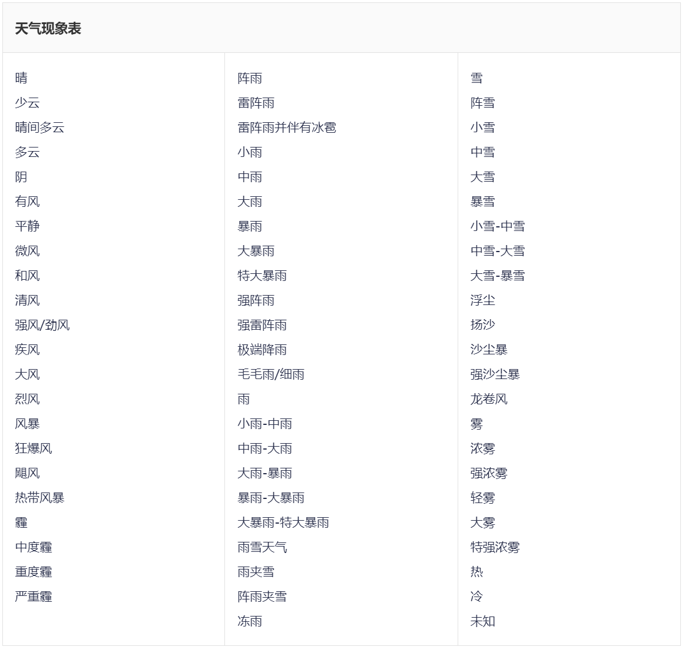

# AMap Weather

本文主要介绍以高德地图天气预报接口开发天气模块。以下内容讲述具体的实现步骤。

## 注册高德开放平台开发者

打开[高德控制台](https://console.amap.com/dev/id/phone)

## 创建应用

1. 进入[我的应用](https://console.amap.com/dev/key/app)，点击**创建新应用**，应用类型选择**天气**，点击**新建**
2. 创建应用成功后，回到列表，点击**添加 Key**，服务平台类型选择 **Web 服务**，然后点击**提交**按钮
3. 添加成功后，在应用表单列表会显示 **Key** 的值，后续的接口调用就可以使用了

## 查看天气预报 API 接口文档

接口详细信息请查看：[高德地图天气预报接口](https://lbs.amap.com/api/webservice/guide/api/weatherinfo)

1. 关键参数如下：

    **API服务地址：**

    **GET** <https://restapi.amap.com/v3/weather/weatherInfo?key=${key}&city=${city}&extensions=${extensions}&output=${output}>

    其中 **`${key}、${city}、${extensions}、${output}`** 需要替换为具体的值。

    **请求参数说明：**

    - **key**：请求服务权限标识，创建的应用的 **key** 值
    - **city**：[城市编码](https://lbs.amap.com/api/webservice/download)
    - **extensions**：气象类型，可选值：**base/all**，**base** 返回实况天气,**all** 返回预报天气
    - **output**：返回格式，默认 **JSON**，可选值：**JSON**, **XML**

    **返回结果：**

    实况天气每小时更新多次，预报天气每天更新3次，分别在8、11、18点左右更新。由于天气数据的特殊性以及数据更新的持续性，无法确定精确的更新时间，请以接口返回数据的reporttime字段为准。[天气结果对照表>>](https://lbs.amap.com/api/webservice/guide/tools/weather-code/)

    **实况天气：**

    ```json
    {
        "status": "1", // 返回状态, 1：成功；0：失败
        "count": "1", // 返回结果总数目
        "info": "OK", // 返回的状态信息
        "infocode": "10000", // 返回状态说明,10000代表正确
        "lives": [
            {
                "province": "广东", // 省份
                "city": "南沙区", // 城市
                "adcode": "440115", // 地区编码
                "weather": "阴", // 天气现象
                "temperature": "26", // 温度
                "winddirection": "东", // 风向
                "windpower": "≤3", // 风力等级
                "humidity": "99", // 湿度
                "reporttime": "2023-09-14 10:31:13", // 发布时间
                "temperature_float": "26.0", // 温度, float
                "humidity_float": "99.0" // 湿度, float
            }
        ]
    }
    ```

    **未来四天天气预报（最多四天）：**

    ```json
    {
        "status": "1",
        "count": "1",
        "info": "OK",
        "infocode": "10000",
        "forecasts": [
            {
                "city": "南沙区",
                "adcode": "440115",
                "province": "广东",
                "reporttime": "2023-09-13 17:31:19",
                "casts": [
                    {
                        "date": "2023-09-13",
                        "week": "3",// 周数
                        "dayweather": "雷阵雨", // 白天天气现象
                        "nightweather": "中雨", // 夜间天气现象
                        "daytemp": "31", // 最高温度
                        "nighttemp": "25", // 最低温度
                        "daywind": "北", // 白天风向
                        "nightwind": "北", // 夜间风向
                        "daypower": "1-3", // 白天风力
                        "nightpower": "1-3", // 夜间风力
                        "daytemp_float": "31.0", // 最高温度, float
                        "nighttemp_float": "25.0" // 最低温度, float
                    },
                    {
                        "date": "2023-09-14",
                        "week": "4",
                        "dayweather": "中雨",
                        "nightweather": "大雨",
                        "daytemp": "30",
                        "nighttemp": "24",
                        "daywind": "北",
                        "nightwind": "北",
                        "daypower": "1-3",
                        "nightpower": "1-3",
                        "daytemp_float": "30.0",
                        "nighttemp_float": "24.0"
                    },
                    {
                        "date": "2023-09-15",
                        "week": "5",
                        "dayweather": "大雨",
                        "nightweather": "雷阵雨",
                        "daytemp": "29",
                        "nighttemp": "25",
                        "daywind": "北",
                        "nightwind": "北",
                        "daypower": "1-3",
                        "nightpower": "1-3",
                        "daytemp_float": "29.0",
                        "nighttemp_float": "25.0"
                    },
                    {
                        "date": "2023-09-16",
                        "week": "6",
                        "dayweather": "雷阵雨",
                        "nightweather": "多云",
                        "daytemp": "31",
                        "nighttemp": "26",
                        "daywind": "北",
                        "nightwind": "北",
                        "daypower": "1-3",
                        "nightpower": "1-3",
                        "daytemp_float": "31.0",
                        "nighttemp_float": "26.0"
                    }
                ]
            }
        ]
    }
    ```

    **天气结果对照：**

    **天气现象：**

    

    **风力表：**

    

    **风向表：**

    

2. 请求示例

    ```bash
    curl --location 'https://restapi.amap.com/v3/weather/weatherInfo?key=${key}&city=440115&extensions=all&output=JSON'
    ```

3. 配额限制说明

    | 服务 | 调用量上限（次/日） | 并发量上限（次/秒） |
    | --- | --- | --- |
    | 天气预报 | 300000 | 200 |

## 更新天气模块配置

1. 进入 **MagicMirror** 目录

    ```bash
    cd ./MagicMirror
    ```

2. 编辑 **config.js** 文件

    ```bash
    sudo nano ./config/config.js
    ```

3. 修改天气模块

    初始模块调用的是 **OpenWeather** 的接口：

    ```jsx
    // 实时天气
    {
       module: "weather",
       position: "top_right",
       config: {
        weatherProvider: "openweathermap",
        type: "current",
        location: "New York",
        locationID: "5128581", //ID from http://bulk.openweathermap.org/sample/city.list.json.gz; unzip the gz file and find your city
        apiKey: "YOUR_OPENWEATHER_API_KEY"
       }
    },
    // 预报天气
    {
       module: "weather",
       position: "top_right",
       header: "Weather Forecast",
       config: {
        weatherProvider: "openweathermap",
        type: "forecast",
        location: "New York",
        locationID: "5128581", //ID from http://bulk.openweathermap.org/sample/city.list.json.gz; unzip the gz file and find your city
        apiKey: "YOUR_OPENWEATHER_API_KEY"
       }
    }
    ```

    将上述配置更改为：

    ```jsx
    {
       module: "weather",
       position: "top_right",
       config: {
        updateInterval: 20 * 60 * 1000, // 20分钟更新一次,
        weatherProvider: "amapweather",
        type: "current",
        city: "440115",
        extensions: "base",
        key: "${key}",
        degreeLabel: true,
        showHumidity: true
       }
    },
    {
       module: "weather",
       position: "top_right",
       header: "4天天气预报",
       config: {
        updateInterval: 6 * 60 * 60 * 1000, // 6小时更新一次,
        weatherProvider: "amapweather",
        type: "forecast",
        city: "440115",
        extensions: "all",
        key: "${key}",
        colored: true
       }
    },
    ```

    其中 **${key}** 需要更改为高德地图申请的 **key** 值。

4. 按下 **Ctrl + X** 退出，然后按下 **Y** 保存文件
5. 启动服务，测试接口

    ```bash
    npm run start
    ```

6. 如果遇到问题可以查看启动的日志输出，或者按下 **Ctrl + Shift + i** 打开浏览器开发者调试，查看具体的请求以及输出的日志

    **效果如下：**

    
